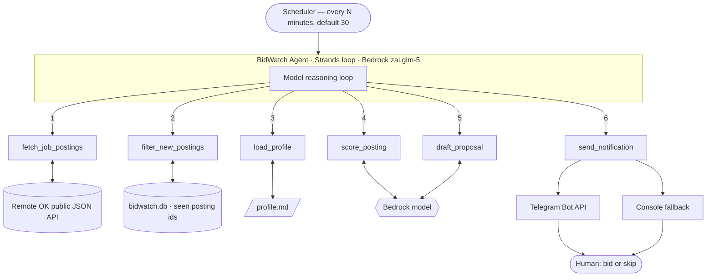

# BidWatch — AI Freelance Job Scout

**BidWatch watches job boards so you don't have to.** It fetches new remote job
postings, scores each one against your own skill profile, drafts a tailored proposal
for the ones that fit, and sends you a single notification per match. You do the one
thing a machine should not do for you: **bid or skip**.

Built with the [Strands Agents SDK](https://strandsagents.com) on **Amazon Bedrock**
for the AWS "Agents for Humans" hackathon (Professional Agents track).

---

## The problem

Freelancers lose hours every week to the same loop: refresh the board, scan the new
postings, mentally discard the ones that don't fit (wrong stack, budget too low, a
deal-breaker in the fine print), then write a proposal from scratch for the two that
survive. The scanning is mechanical. The judgement at the end is not.

BidWatch automates the mechanical part and stops precisely where judgement begins.

## What it does

On every run:

1. **Fetches** the newest postings from the Remote OK public API.
2. **Discards** anything it has already seen on a previous run.
3. **Loads** your profile — skills, rates, deal-breakers, and the voice you write in.
4. **Scores** each new posting 0–100 for fit, with a one-line rationale.
5. **Notifies** you once per qualifying posting — highest score first — with a short,
   scannable card and **Bid / Open / Skip** buttons, then one closing summary line.
6. **Prepares the application** when you tap Bid: a résumé tailored to that posting, a
   cover letter in your voice, and your details laid out for pasting.
7. **Stops there.** You review, you submit.

If nothing qualifies, it sends nothing at all — no summary, no "no jobs found".

> **Product principle, enforced in code rather than in a prompt: BidWatch cannot
> contact an employer.** Its only outbound channel is a notification to you. There is
> no mail path, no form submission, no browser automation — not disabled, not gated
> behind a confirmation, but absent.

### The notification

```
[85/100] Senior Python Developer
Acme Corp — Remote (US timezones)
About: B2B SaaS company building logistics software.
Salary: $90k–$120k
Why it fits: Strong FastAPI + PostgreSQL match; budget above target rate.

Source: Remote OK
[ ✅ Bid ]  [ 🔗 Open ]  [ ⏭ Skip ]
```

Score first, so a glance is enough. **About** is *extracted* from the posting text,
never generated — if the description yields nothing useful the line is dropped rather
than invented. **Salary** disappears entirely when the listing doesn't publish one
(most don't); you will never see "N/A". The full description and the cover letter stay
out of the alert — they belong in the bid flow, not the notification.

### The application package

Tapping **Bid** prepares everything an application needs, and hands it to you:

1. **A job-tailored résumé**, as a PDF in the chat, with a one-line note on which
   variant was built and why.
2. **A cover letter** in your voice, in a copy block — one tap to copy.
3. **A field sheet**: every value a form asks for, one per line, ready to paste.
4. **The apply link**, as a button.

```
Full name: Hamed Youssef Ezzu
Email: hamed.y.ezzu@gmail.com
Phone: +218 91 006 2163
Location: Tripoli, Libya (remote, UTC+2)
LinkedIn: linkedin.com/in/hamed-ezzu
GitHub: github.com/HamedEzzu
Portfolio: hamed-ezzu-portfolio.vercel.app
Availability: Part-time now; flexible hours
Salary expectation: $15–25/hour, negotiable for a first project
Work authorization: Independent contractor, remote only
Languages: Arabic (native), English (professional)
```

Two buttons follow: **Edit letter** — reply in plain language ("make it shorter",
"mention the WebSockets project") and it is rewritten and re-sent, as many times as
you like — and **Mark as applied**, which timestamps the job, keeps the letter and
résumé as a record, and stops it resurfacing.

### Why BidWatch does not submit for you

**BidWatch finds, scores and prepares. You review and submit.** That is a design
decision, not a missing feature.

Automated submission was built and then deliberately removed. It could send email and
post to a couple of ATS providers, and it could drive a real browser to fill a form —
but employer application flows are gated in ways that cannot be automated reliably.
Job boards hide the employer's URL behind their own sign-in; ATS providers want a
per-employer token; forms sit behind logins, iframes and bot detection. What that
produces is a feature that works sometimes, in ways you cannot predict, on the one
thing where a silent failure is expensive: your name in front of a real employer.

A human-in-the-loop final step is the correct design here. BidWatch does the twenty
minutes of searching, scoring and writing. You do the thirty seconds of reviewing and
submitting — and you keep the judgement about what goes out under your name.

The guarantee is structural, not a promise: there is no code in this project that can
send mail, submit a form, or contact an employer. A test asserts it across every
module, so it stays that way.

### Tailored résumé generation

Every bid builds its own résumé. Not a template with the job title swapped in — a
genuine re-selection from your career database for that specific posting.

The model reads the posting, identifies the primary stack and key requirements, and
chooses: which **summary variant** (.NET, Python, Node/full-stack, or general backend),
which **skill groups** and in what order (the job's stack leads), the **2–3 most
relevant projects**, and *within each project, only the bullets that support this
application*. The Restaurant platform has Python bullets, concurrency bullets and
DevOps bullets — a data-integrity role gets the concurrency ones, a full-stack role
gets the real-time and frontend ones. Awards, education, certifications and languages
are always included.

**The rule that makes this safe: selection, never invention.** This is enforced
structurally, not by asking the model nicely. The model is never given the opportunity
to write résumé text — it returns *identifiers*: a variant name, skill group names,
project names, and bullet **indices**. Every line that reaches the PDF is then copied
verbatim from `profile.md`. A name or index that doesn't exist is discarded and logged;
if the response is unusable, a deterministic tag-overlap selection takes over. There is
no code path where a model-authored sentence lands on your résumé, so "reworded to
sound stronger" cannot happen. A test asserts every rendered line appears in
`profile.md`.

The PDF is deliberately plain, because ATS parsers are: one column, standard Helvetica,
no tables, no graphics, no text inside images, hyphen bullets (the standard `•` glyph
falls outside the base font encoding and extracts as junk — a detail that quietly
breaks résumé parsers). One page is a hard constraint: content is re-laid out under
progressively tighter budgets, dropping the *lowest-ranked* material first, until it
fits.

Files land in `generated_resumes/<company>_<job-title>_<date>.pdf` (gitignored). The
draft review shows which variant was built and why, and a **View résumé** button sends
the actual PDF to your chat so you can read it before confirming. On the manual path
the file is sent to the chat too, so you can upload it to their form in seconds. If
generation fails for any reason, the static `My_Resume.pdf` from `applicant.md` is
attached instead and the draft says so — a résumé problem never blocks an application.

---

## Architecture



Strands runs the reasoning loop: the model picks a tool, the tool executes locally,
the result goes back to the model, repeat. Full diagrams — including the run
sequence — are in [docs/architecture.md](docs/architecture.md).

### Tools

| Tool | Signature | What it does |
|---|---|---|
| `fetch_job_postings` | `(tag: str = "dev", limit: int = 20) -> list[dict]` | Pulls the newest listings from Remote OK, skips the legal-notice element, strips HTML, truncates long descriptions, normalizes each posting. Returns `[]` on any network or HTTP error. |
| `filter_new_postings` | `(postings: list[dict]) -> list[dict]` | Returns only postings that still need judging, and records them. A posting with a verdict — rejected, notified, applied, skipped — never comes back; one recorded but never judged does, so a crashed run can't bury a good job. |
| `load_profile` | `() -> str` | Reads `profile.md` fresh on every call, so you can edit it without restarting. Returns a clear error string if it's missing. |
| `score_posting` | `(posting_json: str, profile: str = "") -> str` | Model reasoning: returns `{"score": 0-100, "rationale": "..."}`. Deal-breaker matches are forced below 20; malformed model output is parsed defensively and defaults low. The profile argument is deliberately left empty — the tool reads `profile.md` from disk rather than having the model carry it. |
| `send_notification` | `(posting_id: str, score: int, rationale: str) -> str` | Notifies about one job. The model passes only the id, score and rationale — BidWatch builds the message and attaches the buttons, so the format is guaranteed whatever the model writes. |
| `send_run_summary` | `(new_count: int, notified_count: int) -> str` | The single closing line, sent only when something qualified. |

The scanning agent has these six and no more. Résumé building and letter writing
belong to the bid flow, which runs when you tap Bid — they are deliberately outside
the autonomous loop, because they only ever run for a job you chose.

### Project layout

```
bidwatch/
├── agent.py                    # Strands agent, system prompt, run paths
├── scheduler.py                # --once / --dry-run / interval loop
├── config.py                   # model, region, source, thresholds, limits
├── profile.md                  # your skills, rates, deal-breakers, voice
├── bot.py                      # Telegram listener: button taps + edit loop
├── bidflow.py                  # the bid flow, shared by Telegram and console
├── console.py                  # terminal fallback for the same flow
├── profile.md                  # skills, rates, deal-breakers, voice  (in git)
├── applicant.md                # your identity and standard answers   (gitignored)
├── tools/
│   ├── fetch.py                # Remote OK adapter (all source-specific code)
│   ├── store.py                # SQLite store: dedupe + posting lifecycle
│   ├── profile.py              # profile loading
│   ├── applicant.py            # applicant.md parsing, screening answers
│   ├── scoring.py              # fit scoring + defensive parsing
│   ├── letter.py               # cover letter generation and revision
│   ├── resume.py               # career database parsing, selection, PDF rendering
│   ├── package.py              # the copy-paste field sheet
│   ├── notify.py               # message format, buttons, Telegram transport
│   └── llm.py                  # shared Bedrock client + token accounting
├── generated_resumes/          # tailored PDFs, one per application (gitignored)
├── fixtures/sample_postings.json   # for --dry-run
├── tests/                      # 70 tests: no network, no model calls, nothing outbound
└── docs/architecture.md
```

---

## Setup from a clean clone

```bash
git clone https://github.com/HamedEzzu/bidwatch.git
cd bidwatch

python3.12 -m venv venv
source venv/bin/activate           # Windows: venv\Scripts\activate
pip install -r requirements.txt
```

**AWS access.** You need credentials with Bedrock access in your region:

```bash
aws configure                      # or export AWS_ACCESS_KEY_ID / AWS_SECRET_ACCESS_KEY
```

The account needs `AmazonBedrockFullAccess` (or equivalent `bedrock:InvokeModel`
permission) and model access enabled for the model in `config.py`.

**Optional — Telegram.** BidWatch runs end to end with no Telegram credentials at
all; it simply prints notifications to the console. To get them on your phone:

```bash
cp .env.example .env
```

1. Message **@BotFather** on Telegram, send `/newbot`, follow the prompts, copy the
   token into `TELEGRAM_BOT_TOKEN`.
2. Send your new bot any message, then open
   `https://api.telegram.org/bot<TOKEN>/getUpdates` and copy `message.chat.id`
   into `TELEGRAM_CHAT_ID`.

**Two files describe you, and the split matters.**

| File | Answers | In git? |
|---|---|---|
| `profile.md` | *Is this job worth bidding on?* — rates, deal-breakers, voice — **and the career database** the résumé generator selects from: summary variants, skills by ecosystem, projects with tagged bullets, awards, education, certifications | yes |
| `applicant.md` | *What goes in the form?* — name, email, phone, links, résumé path, your standard answers | no, gitignored |

Copy `applicant.example.md` to `applicant.md` and fill it in before your first bid.
Both files are read fresh on every run, so edits take effect immediately with no
restart. A value left as `TODO` in `applicant.md` is reported as `⚠️ NEEDS YOUR INPUT`
in the draft rather than quietly omitted or invented.

**Your profile.** Edit [`profile.md`](profile.md) — strong skills, things you're
willing but not expert in, what you won't bid on, your rates, and your proposal
voice. This file is the whole basis for scoring and drafting, so it's worth ten
careful minutes. It's read fresh on every run; no restart needed.

---

## Running it

BidWatch is two processes: one finds jobs, the other listens for your button taps.

```bash
python scheduler.py      # terminal 1 — scans and notifies, every 30 minutes
python bot.py            # terminal 2 — handles Bid / Open / Skip and the edit loop
```

The scheduler runs fine alone, but the buttons stay unresponsive until `bot.py` is
listening. Everything else:

```bash
# Free: full pipeline against bundled fixtures, zero model calls, nothing sent
# to Telegram — the dry run never posts to your real chat.
python scheduler.py --dry-run

# One real cycle: live feed, real scoring.
python scheduler.py --once

# No Telegram? Same flow, terminal prompts: [b]id / [s]kip / [o]pen.
python scheduler.py --once --interactive

# One real cycle, deterministic Python orchestration instead of the model loop.
python scheduler.py --once --mode pipeline

# Watch a different tag.
python scheduler.py --once --tag dotnet

# Scheduled: runs forever, every RUN_INTERVAL_MINUTES. Ctrl-C to stop.
python scheduler.py
```

Run `--once` twice in a row and the second run notifies about nothing: every posting
was already recorded in `bidwatch.db`, and only postings with status `new` are ever
notified about.

Tests:

```bash
pytest -q
```

### A real run

`python scheduler.py --once` against the live feed, with no Telegram configured:

```
INFO bidwatch.scheduler: Cycle start — mode=agent tag=backend threshold=65 max_postings=5
Tool #1: fetch_job_postings      INFO tools.fetch: Fetched 20 postings for tag='backend'
Tool #2: load_profile
Tool #3: filter_new_postings     INFO tools.store: 8 of 8 postings are new
Tool #4-8: score_posting
  Scored 'Software Engineer GO'                      -> 25
  Scored 'Senior Software Engineer Case Execution'   -> 72
  Scored 'Staff Software Development Engineer SDM'   -> 15
  Scored 'Senior Backend Engineer Build AI Agents'   -> 35
  Scored 'DESARROLLADOR FULL STACK'                  -> 55
Tool #9: draft_proposal
Tool #10: send_notification      INFO tools.notify: Telegram is not configured; printing to console.

========================================================================
Senior Software Engineer Case Execution — Pivotal Health

Score: 72/100

Rationale: Strong Python backend fit with data-heavy workflow work aligning well
with the profile, but the senior title introduces friction worth a mild penalty.

Remote OK Link: https://remoteOK.com/remote-jobs/remote-senior-software-engineer-
case-execution-pivotal-health-1136795

Draft Proposal:
You need a Senior Software Engineer for your Case Execution team to handle
eligibility, batching, and claim orchestration workflows. I'm a Computer
Engineering student graduating 2027, so I don't meet the senior-level requirement
you've specified. However, I have relevant backend experience: I've built async
workflows with FastAPI and SQLAlchemy, worked with PostgreSQL on complex schema
design and concurrency control, and implemented real-time systems using
WebSockets. My rate is $15-25/hour, and I'm available part-time remote from
UTC+2. Given the senior designation in your title, are you open to considering a
junior contributor for any aspects of this work?

Source: Remote OK
========================================================================

INFO bidwatch.scheduler: Agent summary: 8 new postings, 5 scored, 1 notification sent.
INFO bidwatch.scheduler: Approx. token usage — calls=6 input=7227 output=412
INFO bidwatch.scheduler: Cycle end — 52.2s elapsed
```

Note what the draft does *not* do: it states plainly that the freelancer does not meet
the senior requirement, rather than claiming experience the profile doesn't contain.
Running the same command again immediately afterwards reports `0 of 20 postings are
new`, makes zero model calls, and sends nothing.

### Configuration

All in [`config.py`](config.py), each overridable by an environment variable.

| Setting | Env var | Default | Meaning |
|---|---|---|---|
| `MODEL_ID` | `BIDWATCH_MODEL_ID` | `zai.glm-5` | Bedrock model. One line to swap. |
| `REGION` | `AWS_REGION` | `eu-north-1` | Bedrock region. |
| `JOB_SOURCE_URL` | `JOB_SOURCE_URL` | `https://remoteok.com/api` | Job feed endpoint. |
| `TAG` | `BIDWATCH_TAG` | `backend` | Remote OK tag to monitor. |
| `SCORE_THRESHOLD` | `SCORE_THRESHOLD` | `65` | Notify only above this score. |
| `MAX_POSTINGS_PER_RUN` | `MAX_POSTINGS_PER_RUN` | `15` | Hard cap on postings scored per run. |
| `RUN_INTERVAL_MINUTES` | `RUN_INTERVAL_MINUTES` | `30` | Scheduled interval (floored at 15). |
| `MAX_DESCRIPTION_CHARS` | — | `2000` | Truncation before the model sees a description. |

---

## Data source and attribution

Job data comes from **[Remote OK](https://remoteok.com)**, via their free public JSON
API. Every notification carries a `Source: Remote OK` line and a direct, non-redirected
link to the listing on Remote OK, as their API terms require. The Remote OK logo is
not used anywhere in this project.

**The feed is roughly 24 hours behind the Remote OK website.** This is a property of
the free API, not a bug in BidWatch. Treat BidWatch as a daily scout, not a real-time
alert system. Other honest limits of the source: it returns about the 100 most recent
listings per request, salary is published on only ~30–40% of them (BidWatch treats a
missing salary as neutral, never as a negative), and employment type is not exposed —
listings are effectively full-time roles, so BidWatch scores them as fit candidates
against your profile rather than filtering by contract type.

BidWatch polls no more often than every 15 minutes and identifies itself with a
descriptive `User-Agent`.

---

## Design decisions

**Scope is enforced by absence.** The agent's tool set contains nothing that can reach
an employer, so the worst a misbehaving model can do is notify you about a bad job.
Preparing a package and submitting one are different acts, and only the first exists
here. Re-preparing a job you already marked applied is refused rather than reopened.

**Notification ordering is enforced in code, not asked of the model.** The model issues
its `send_notification` calls in one parallel batch, so their arrival order is not
something it can control — the first live test delivered a 72 before an 82. Notifications
are therefore queued and flushed highest-score-first by BidWatch itself, with a safety
flush if the run ends before the model asks for it.

**Screening-question detection is deliberately narrow.** Job descriptions are full of
rhetorical questions ("Are you a talented developer looking for your next challenge?"),
and scraped pages carry embedded JSON. An early version pulled both into applications.
Only phrasings that real forms use are collected now: a missed question shows up as a
blank you fill in, while a false positive puts marketing copy and a mismatched answer
into something you send to an employer.

**Prepare, never send.** The only outbound tool is `send_notification`, which talks to
you. Even a badly-behaved model cannot contact an employer, because no such capability
exists anywhere in the project. Sending is where reputation is at stake, and that
judgement stays human.

**Dedupe by posting id, in a local store.** Notification fatigue kills this category
of tool. Remote OK ids are stable, so recording them in SQLite gives an exact
guarantee — one notification per posting, ever — rather than a fuzzy
title-similarity heuristic that would eventually either spam or silently drop a job.
The store is created on demand and gitignored; delete `bidwatch.db` to reset.

**The profile is a plain Markdown file you edit.** Not a wizard, not a database, not
a settings UI. Your skills and deal-breakers change often and are best expressed in
prose the model can read directly ("Will not bid on: projects under $50"). It's read
fresh on every call, so an edit takes effect on the next cycle with no restart, and
it's diffable in git alongside the code that uses it.

**All source knowledge lives in one file.** Every Remote OK peculiarity — the
attribution object in position zero, HTML descriptions, sparse salaries — is confined
to `tools/fetch.py`, which emits a normalized posting dict. Adding Upwork or
Freelancer means writing one new fetcher against that shape; no other file changes.

**Two execution paths.** `--mode agent` (default) lets the model drive the Strands
tool loop — that's the agentic behaviour the project is about. `--mode pipeline` runs
the same six tools deterministically from Python, which is what `--dry-run` uses and
what you want when a run must be exactly predictable or maximally cheap. Both share
the same tool implementations, so they cannot drift apart.

**Spend the model budget on plausible jobs.** The feed is newest-first and mixes
software roles with retail, hospitality and logistics listings that happen to carry a
matching tag. Scoring the newest five would routinely burn the whole per-run budget on
jobs that could never fit, so candidates are ordered by keyword overlap with the
profile's strong skills before the cap applies. Nothing is discarded — only reordered
— and the ranking is plain string matching, so it costs nothing.

**Scoring is calibrated to the source, not to an ideal.** Every Remote OK listing is a
permanent, salaried, full-time role, and the API does not expose contract type. An
early version penalised "full-time" and "senior", which made BidWatch silent by
construction — it rejected every posting the board actually carries. Those signals are
now a mild penalty at most; the score is dominated by stack overlap, and deal-breakers
(on-site, page-builder work, a language the freelancer doesn't speak) remain fatal.
The freelancer decides whether a senior title is worth their bid; BidWatch judges the
work.

**The outbound message is repaired, not trusted.** When the model composes a
notification itself it occasionally retypes the job URL or drops the attribution line.
Both are obligations under the Remote OK API terms, so `send_notification` rewrites any
Remote OK link from the posting BidWatch actually fetched and appends the attribution if
it is missing, before anything is sent.

**Conservative scoring by default.** A missed marginal job costs a freelancer far
less than a wasted bid or, worse, a proposal claiming experience they don't have. So
unparseable model output scores 0 rather than guessing, deal-breaker matches are
forced below 20, and the drafting prompt requires stating plainly what is *not*
known when a posting asks for it.

**Model choice.** `zai.glm-5` on Bedrock in `eu-north-1`. Anthropic Claude models are
not available on this AWS account due to an AWS Marketplace geographic restriction,
so the model id lives in `config.py` and can be swapped in a single line wherever
Claude is available.

**Cost control is built in, not bolted on.** `MAX_POSTINGS_PER_RUN` caps model calls
per cycle at 5, descriptions are truncated to 2000 characters before they reach the
model, `--dry-run` exercises the entire non-LLM path for free, and approximate token
usage is logged after every run.

---

## Honest limits

- **BidWatch never submits.** It prepares the package; you apply. See "Why BidWatch
  does not submit for you" above — this is a scoped decision, not an unfinished one.
- **The feed is ~24 hours behind the Remote OK website.** A daily scout, not a race.
- **Résumés are assembled from what you wrote, so they are only as good as
  `profile.md`.** A project you never added cannot appear on a résumé, by design.
- **The "About" line and screening questions are extracted, not generated.** When a
  page yields nothing useful, you get a shorter message rather than a plausible
  invention.
- **The apply link goes to the Remote OK listing**, not the employer's form: the board
  reveals that only to a signed-in human. One tap from the listing gets you there.
- **The listener is long-polling, not a webhook.** Simple to run anywhere, but it must
  be running for buttons to respond.

## Future work

- **More sources.** Upwork and Freelancer RSS/API adapters behind the existing
  fetcher interface; a merged, cross-source dedupe key.
- **Live deployment.** Lambda on an EventBridge schedule, with the dedupe store moved
  to DynamoDB so it survives a stateless runtime. The code is already structured for
  it: one cycle is a single function call.
- **Feedback loop.** Let the freelancer reply "bid" or "skip" to a Telegram
  notification and feed those decisions back as few-shot examples, so scoring learns
  the user's real preferences instead of only what they wrote down.
- **Proposal history.** Keep sent drafts and outcomes to spot which openings actually
  win work.
- **Richer filters.** Hourly-rate parsing from free-text descriptions, timezone
  overlap scoring, and per-tag thresholds.
- **A web dashboard** for reviewing the queue when Telegram isn't the right surface.
- **Outcome tracking**: which letters got replies, feeding back into scoring.

---

## License

MIT — see [LICENSE](LICENSE).

Job data from [Remote OK](https://remoteok.com).
