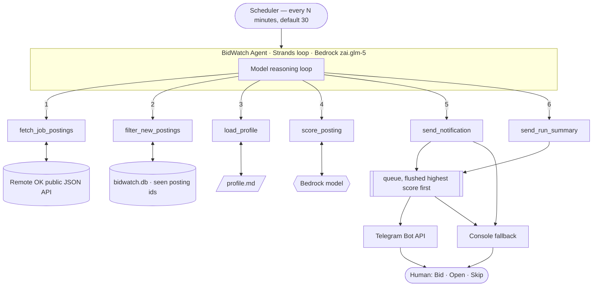
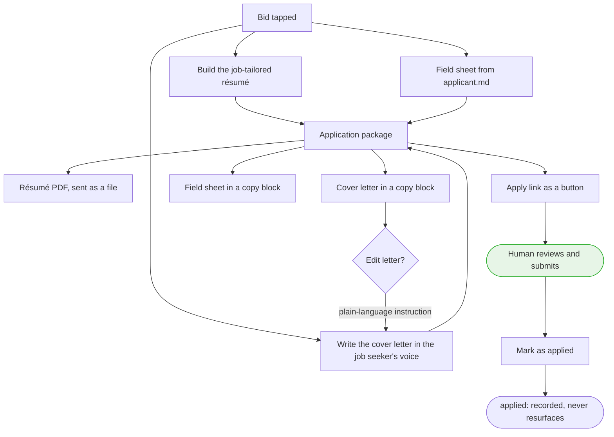
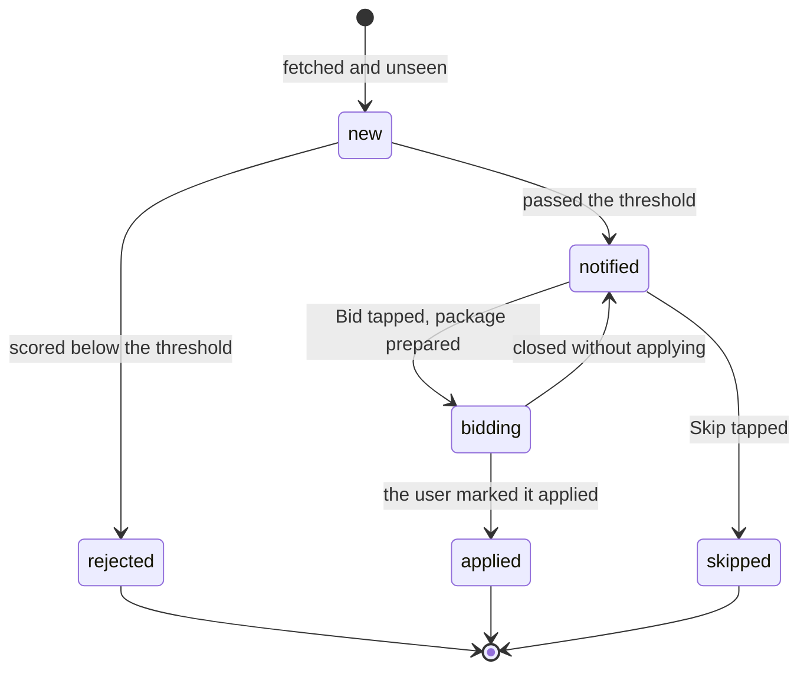
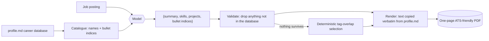

# BidWatch — Architecture

BidWatch is a single [Strands Agents](https://strandsagents.com) agent running on
Amazon Bedrock, with six tools. Strands owns the reasoning loop: the model decides
which tool to call, the tool executes locally, the result returns to the model, and
the loop repeats until the run is complete.

## Agent loop



## The application package

Scanning and applying are deliberately separate, and only one of them exists in code.
BidWatch prepares a package; the person submits it. There is no module here that can
send mail, post a form, or drive a browser.



Automated submission was built and removed on purpose: employer flows are gated in
ways that cannot be automated reliably, and a feature that works unpredictably is worse
than none when the output carries someone's name to a real employer.

## Posting lifecycle

Every posting has exactly one status in the store, and only `new` may be notified
about, so nothing already handled can resurface:



Only a posting with a verdict is withheld from later runs. One recorded but never
judged — a crashed run, a truncated tool call — comes back, so a transient failure
cannot bury a good job.

## Two processes

```
python scheduler.py     finds jobs, scores them, sends notifications
python bot.py           listens for button taps and the edit-letter replies
```

The scheduler can run alone — you will get alerts, but the buttons will not respond
until `bot.py` is listening. With no Telegram credentials, `scheduler.py --once
--interactive` runs the identical flow as terminal prompts.

## Run sequence

```mermaid
sequenceDiagram
    participant Sch as Scheduler
    participant Ag as BidWatch Agent
    participant ROK as Remote OK API
    participant DB as bidwatch.db
    participant M as Bedrock model
    participant U as job seeker

    Sch->>Ag: run one cycle
    Ag->>ROK: fetch_job_postings(tag, limit)
    ROK-->>Ag: ~100 recent listings (first element = legal notice, skipped)
    Ag->>DB: filter_new_postings(postings)
    DB-->>Ag: only unseen ids (and records them)
    Ag->>Ag: load_profile() — read profile.md fresh
    Ag->>Ag: rank candidates by profile keyword overlap (free, no model call)
    loop at most MAX_POSTINGS_PER_RUN new postings
        Ag->>M: score_posting(posting, profile)
        M-->>Ag: {"score": 0-100, "rationale": "..."}
        alt score >= SCORE_THRESHOLD
            Ag->>Ag: queue a notification for this posting
        else below threshold
            Ag->>Ag: skip quietly
        end
    end
    Ag->>U: flush queued notifications, highest score first
    Ag->>U: one closing summary line
    Note over Ag,U: If nothing qualifies, nothing is sent at all.<br/>BidWatch prepares; the human confirms.
```

## Components

| Layer | File | Responsibility |
|---|---|---|
| Entry point | `scheduler.py` | `--once`, `--dry-run`, or interval loop; per-cycle logging |
| Agent | `agent.py` | Strands agent, system prompt, tool registry, deterministic pipeline path |
| Source adapter | `tools/fetch.py` | All Remote OK specifics; emits normalized postings |
| Dedupe | `tools/store.py` | SQLite store of seen posting ids |
| Profile | `tools/profile.py` | Fresh read of `profile.md` on every call |
| Scoring | `tools/scoring.py` | 0–100 fit score + rationale, defensive JSON parsing |
| Drafting | `tools/drafting.py` | Proposal under 150 words in the job seeker's voice |
| Delivery | `tools/notify.py` | Telegram, with console fallback |
| Model access | `tools/llm.py` | Shared Bedrock client + token-usage accounting |

## Two execution paths

The same six steps can run either way:

- **`--mode agent`** (default for `--once`): the model drives the Strands tool loop
  and decides the order of calls. This is the agentic path.
- **`--mode pipeline`**: the same tools called deterministically from Python. Used by
  `--dry-run` (zero model calls) and useful when a run must be exactly predictable
  or maximally cheap.

## Résumé selection

The model never writes résumé text. It returns identifiers — a summary variant name,
skill group names, project names and bullet **indices** — and every line is then copied
verbatim out of `profile.md`. Unknown names and out-of-range indices are discarded, and
an unusable response falls back to deterministic tag matching. Invention is not
forbidden by instruction; it has no path into the document.



## Source abstraction

Every Remote OK detail — the endpoint, the legal-notice first element, HTML in
descriptions, the sparse salary fields — is confined to `tools/fetch.py`. The rest of
the system only consumes the normalized posting dict:

```
{id, title, company, description, tags, url, salary_min, salary_max, location, posted_at}
```

Adding a second job source means adding a fetcher that emits this shape. No other
file changes.

## Cost control

| Control | Where | Default |
|---|---|---|
| Postings scored per run | `MAX_POSTINGS_PER_RUN` | 5 |
| Description truncation before the model sees it | `MAX_DESCRIPTION_CHARS` | 2000 chars |
| Zero-model test path | `--dry-run` against `fixtures/sample_postings.json` | — |
| Token accounting per run | `tools/llm.py` → logged by the scheduler | always on |
| Poll floor (politeness to the source) | `scheduler.py` | 15 minutes |
| Postings referred to by id, not re-serialized through the model | `tools/fetch.py` cache | always on |
| Candidates ranked before the cap, so the budget goes to plausible jobs | `agent.prioritize` | always on |

Data source: **Remote OK** (https://remoteok.com).
